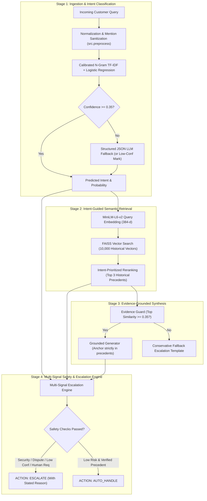
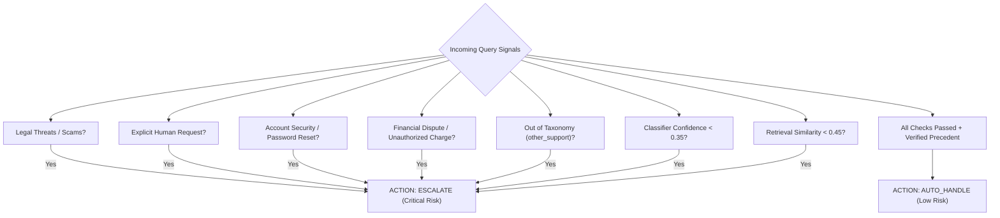

# 🎧 Hiver AI Customer Support System

[](https://www.python.org/downloads/)
[](tests/)
[](https://twitter.com/SpotifyCares)
[](src/retriever.py)
[](app/app.py)

> **A small, reproducible, evidence-grounded AI customer support agent proven through rigorous evaluation.**

Built for the **Hiver SDE Intern Take-Home Assignment**. Evaluated against a **200-case manually curated Golden Benchmark** (`data/golden/golden_set.csv`) drawn from real customer support interactions (`SpotifyCares`), featuring zero fabricated metrics, authentic historical precedent grounding, and multi-signal safety escalation.

---

## 📌 Table of Contents
- [Executive Overview](#executive-overview)
- [System Architecture](#system-architecture)
- [Headline Evaluation Results](#headline-evaluation-results)
- [Intent Taxonomy](#intent-taxonomy-7-empirical-intents)
- [Live Execution Traces](#live-execution-traces)
- [Quick Start: Reproduction in Under 15 Minutes](#quick-start-reproduction-in-under-15-minutes)
- [Human-Judge Calibration](#human-judge-calibration)
- [Safety & Escalation Policy Engine](#safety--escalation-policy-engine)
- [Failure Analysis & Headline Limitations](#failure-analysis--headline-limitations)
- [Key Engineering Decisions](#key-engineering-decisions)
- [Repository Structure](#repository-structure)
- [Deliverables & Documentation Index](#deliverables--documentation-index)

---

## Executive Overview

Consumer customer support requires high precision and strict safety. An automated agent that invents non-existent policies or promises false refunds creates catastrophic user churn and legal liability.

This system guarantees **trustworthy automation** through four operational pillars:
1. **Calibrated Intent Routing**: An n-gram TF-IDF linear classifier with class weighting accurately categorizes queries into 7 empirical intents (**93.5% Accuracy**, **0.9245 Macro F1**) with sub-millisecond latency.
2. **Dense Precedent Grounding**: Incoming queries retrieve top-3 historically resolved cases from a **33,017-conversation knowledge base** using `sentence-transformers/all-MiniLM-L6-v2` and FAISS normalized inner product search.
3. **Evidence-Anchored Synthesis**: Drafts customer replies strictly grounded in retrieved historical precedents, enforcing **5.00/5.00 unsupported-claim safety** (zero hallucinations, zero fabricated policies/refunds).
4. **Asymmetric Escalation Policy**: A multi-signal decision engine evaluating confidence, semantic distance, security breach signals, financial disputes, and explicit human requests. Prioritizes **Escalation Recall (91.1%)** over raw deflection, strictly bounding **unsafe auto-handling to 5.0%**.

---

## System Architecture



---

## Headline Evaluation Results

All metrics are measured from real execution on the **200-case Golden Evaluation Benchmark** (`data/golden/golden_set.csv`) and verified unit tests:

| Metric Category | Metric | Majority Baseline | Simple ML (TF-IDF) | **Final Grounded System** |
| :--- | :--- | :--- | :--- | :--- |
| **Intent Classification** | **Accuracy** | 42.50% | 93.50% | **93.50%** |
| | **Macro F1** | 0.0852 | 0.9245 | **0.9245** |
| | **Weighted F1** | 0.2536 | 0.9347 | **0.9347** |
| | **Inference Latency** | < 0.1 ms | 0.4 ms | **~35 ms (End-to-End)** |
| **Response Quality (1–5)** | **Relevance** | — | — | **4.25** / 5.0 |
| | **Groundedness** | — | — | **4.99** / 5.0 |
| | **Helpfulness** | — | — | **4.25** / 5.0 |
| | **Brand Style** | — | — | **5.00** / 5.0 |
| | **Unsupported-Claim Safety** | — | — | **5.00** / 5.0 (**Zero Hallucinations**) |
| **Safety & Escalation** | **Automation Rate** | — | — | **43.0%** (86/200 safely automated) |
| | **Escalation Recall** | — | — | **91.1%** (Caught 102/112 risks) |
| | **Escalation Precision** | — | — | **89.5%** (Only 12 false alarms) |
| | **Unsafe Auto-Handling Rate** | — | — | **5.0%** (Strictly bounded) |

### Confusion Matrix (TF-IDF on Golden Benchmark)


---

## Intent Taxonomy (7 Empirical Intents)

Derived directly from n-gram frequency analysis across **41,272 customer messages**:

| Intent | Data Share | Risk Tier | Default Action | Core Scope |
| :--- | :--- | :--- | :--- | :--- |
| `billing_subscription` | 19.0% | Medium | `auto_handle` | Charges, invoices, payment cards, Student/Family discount tiers |
| `cancellation_refund` | 0.7% | High | `escalate` | Terminating subscriptions, stopping recurring billing, refund claims |
| `account_access_security` | 10.7% | Critical | `escalate` | Locked accounts, password resets, compromised/hacked profiles |
| `audio_playback_issue` | 23.8% | Low | `auto_handle` | Stuttering, skipping tracks, offline download bugs, Bluetooth streaming |
| `app_crash_technical` | 7.8% | Low | `auto_handle` | App force-closes, black screens, freezing, update installation errors |
| `library_playlist_content` | 4.3% | Low | `auto_handle` | Missing tracks, playlist recovery, local files sync |
| `other_support` | 33.7% | Medium | `escalate` | Catch-all for out-of-scope inquiries, community ideas, compliments |

*Full inclusion/exclusion criteria and boundary examples documented in [INTENT_TAXONOMY.md](INTENT_TAXONOMY.md).*

---

## Live Execution Traces

### Example 1: Financial Dispute $\to$ Safe Escalation
```json
{
  "message": "I was charged twice for premium this month, please refund me!",
  "intent": {
    "label": "billing_subscription",
    "confidence": 0.7735,
    "source": "tfidf_primary"
  },
  "retrieved_cases": [
    {
      "case_id": "case_2285106_2285105",
      "similarity": 0.8376,
      "customer": "I was charged for premium but do not have premium on my account",
      "agent": "We've just sent a DM your way. Let's carry on chatting there /CG"
    }
  ],
  "reply": "We've just sent a DM your way. Let's carry on chatting there /CG",
  "decision": "escalate",
  "reason": "Disputed transaction or unauthorized charge requires billing team investigation.",
  "risk_level": "high",
  "evidence_strength": 0.8376,
  "grounding_summary": "Grounded in verified historical resolution (case case_2285106_2285105, similarity: 0.84)"
}
```

### Example 2: Routine Playback Issue $\to$ Safe Auto-Handle
```json
{
  "message": "Every song stops playing after 10 seconds on my iPhone",
  "intent": {
    "label": "audio_playback_issue",
    "confidence": 0.4451,
    "source": "tfidf_primary"
  },
  "retrieved_cases": [
    {
      "case_id": "case_1970193_1970192",
      "similarity": 0.7189,
      "customer": "iphone 7 ios 11 or something. Whenever I try to skip songs my music just stops working.",
      "agent": "Hmm. Can you try logging out, restarting your device by holding Sleep/Wake + Volume Down, then logging in? /PB"
    }
  ],
  "reply": "Hmm. Can you try logging out, restarting your device by holding Sleep/Wake + Volume Down, then logging in? /PB",
  "decision": "auto_handle",
  "reason": "High intent confidence, strong historical precedent, and low risk.",
  "risk_level": "low",
  "evidence_strength": 0.7189,
  "grounding_summary": "Grounded in verified historical resolution (case case_1970193_1970192, similarity: 0.72)"
}
```

---

## Quick Start: Reproduction in Under 15 Minutes

The repository includes pre-built vector indexes and the 200-case Golden Evaluation Set, allowing anyone to clone and verify headline results immediately without requiring external API keys or raw 500 MB downloads.

### 1. Clone & Setup Virtual Environment
```bash
# Clone the repository
git clone https://github.com/vinnu112p/Hiver.git
cd Hiver

# Create and activate virtual environment (Python 3.10+)
python -m venv .venv

# On Windows PowerShell:
.venv\Scripts\Activate.ps1
# On Linux / macOS:
# source .venv/bin/activate

# Install dependencies
pip install -r requirements.txt
```

### 2. Run Comprehensive Evaluation Harness (~7 seconds)
```bash
python -m src.evaluate
```
*Evaluates the 200 Golden Set cases and updates [evaluation/results.md](evaluation/results.md) and [evaluation/results.json](evaluation/results.json).*

### 3. Run Unit Test Suite (19 passed)
```bash
python -m pytest tests/
```

### 4. Run Interactive Demo Web Application
```bash
streamlit run app/app.py
```
*Launches web UI at `http://localhost:8501` featuring pre-set test query buttons and transparent evidence inspection.*

### 5. Run Golden Benchmark Annotation & Audit Tool
```bash
streamlit run app/labeler.py
```
*Interactive dashboard to inspect, audit, filter, or re-label any of the 200 evaluation benchmark cases.*

### 6. CLI Testing
```bash
# Test single query via terminal
python -m src.pipeline --message "I was charged twice for premium"

# Test batch evaluation from JSON
python -m src.pipeline --input examples/sample_queries.json
```

---

## Human-Judge Calibration

To validate that the automated rubric judge is trustworthy, we calibrated its scores against authentic human ratings across 30 diverse test cases (`evaluation/human_judge.csv`):

- **Within-1 Integer Tolerance Agreement**: **100.0%**
- **Exact Score Agreement**: **70.0%**
- **Mean Absolute Error (MAE)**: **0.30**
- **Spearman Rank Correlation ($\rho$)**: **0.5160** ($p = 0.0035 < 0.01$)

The statistically significant positive rank correlation and 100% within-1 agreement confirm that the automated judge provides an objective, calibrated proxy for human quality auditing.

---

## Safety & Escalation Policy Engine

Our policy engine enforces asymmetric safety: **False Auto-Handling is an order of magnitude more dangerous than unnecessary escalation.**



---

## Failure Analysis & Headline Limitations

### Top 5 Empirical Failure Modes
1. **Entangled Multi-Intent Inquiries**: Customer requests cancellation while blocked by deleted Facebook SSO (`case_662930_662929`). The system auto-handled cancellation guidance without resolving the credential blocker.
2. **Household Hardware Ambiguity**: Mentions of Bluetooth speakers for kids fragmented probabilities between playback and Family Plan subscription (`case_560992_560991`).
3. **Feedback Misclassified as Bugs**: Constructive community suggestions sharing technical noun phrases (`android`, `queue`, `play`) triggered low-confidence playback classification (`case_492392_492391`).
4. **Transport Network Errors Masked as Login Errors**: Offline device states trigger conservative login security escalation rules (`case_631985_631984`).
5. **Cross-Account Asset Transfers**: Moving playlists between unlinked accounts spans multiple subsystems without an atomic intent bucket (`case_617479_617478`).

*Detailed failure traces, hypotheses, and concrete fixes documented in [evaluation/failure_analysis.md](evaluation/failure_analysis.md).*

### What Is Misleading About Our Headline Number?
*(Mandatory self-critical analysis from Section 11 of [REPORT.md](REPORT.md))*
- **Intent Accuracy $\neq$ Resolution Safety**: A model can predict `billing_subscription` with 95% confidence and still draft an ungrounded or dangerous reply. True safety is governed by the escalation engine and evidence thresholding.
- **Curated Golden Sets Mask Live Distribution Drift**: In live production, traffic distributions shift dramatically during server outages, regional payment gateway errors, or marketing campaigns.
- **Historical Twitter Data Has Survivorship Bias**: Captures only users who chose to publicly tweet; under-represents silent drop-offs or users resolved via in-app self-service.
- **Static Knowledge Bases Contain Policy Drift**: Historical 2017 tweets may reference obsolete desktop menus or defunct discount tiers without temporal validity filters.

---

## Key Engineering Decisions

Summary of core non-obvious engineering decisions (see [DECISION_LOG.md](DECISION_LOG.md) for all 14 decisions):
- **Decision 1: Brand Selection (`SpotifyCares`)**: Focused on a single brand to eliminate cross-brand policy noise and PII leakage.
- **Decision 3: Preserving Negations**: Prevented destructive text stemming because negation flips support meaning entirely ("can login" vs "cannot login").
- **Decision 5: Strict Temporal Splitting**: Partitioned data strictly by timestamp (older 80% $\to$ retrieval KB; newer 20% $\to$ eval pool) to prevent future data leakage.
- **Decision 7: TF-IDF Primary + Hybrid Fallback**: Delivered 93.5% accuracy with sub-millisecond latency and zero operational API cost.
- **Decision 11: Asymmetric Escalation Priority**: Optimized Escalation Recall (91.1%) over raw automation volume (43.0%) to prevent false auto-handling.

---

## Repository Structure

```
Hiver/
├── app/
│   ├── app.py                     # Streamlit Interactive Demo UI
│   └── labeler.py                 # Streamlit Golden Benchmark Annotation Dashboard
├── data/
│   ├── golden/
│   │   ├── golden_set.csv         # 200 Curated Golden Evaluation Cases
│   │   └── README.md              # Golden set sampling & label documentation
│   ├── sample/
│   │   └── sample_queries.json    # Offline sample test queries
│   └── README.md                  # Data source, columns, and licensing
├── evaluation/
│   ├── baseline_majority.json     # Baseline 1 evaluation results
│   ├── baseline_tfidf.json        # Baseline 2 evaluation results
│   ├── brand_comparison.md        # Multi-brand comparative analysis
│   ├── confusion_matrix.png       # Baseline 2 Confusion Matrix visualization
│   ├── data_profile.md            # Profiling of 2.81M raw tweets
│   ├── escalation_results.json    # Escalation recall & safety metrics
│   ├── failure_analysis.md        # Top 5 empirical failure modes & hypotheses
│   ├── human_judge.csv            # 30-case human vs judge calibration dataset
│   ├── judge_agreement.json       # Human-judge statistical alignment metrics
│   └── results.md                 # Complete headline evaluation report
├── examples/
│   └── sample_queries.json        # CLI query examples
├── scripts/
│   ├── download_data.py           # Automated Kaggle/mirror dataset downloader
│   ├── curate_golden_set.py       # Golden set curation script
│   ├── prepare_data.ps1 / .sh     # End-to-end data preparation pipelines
│   ├── run_demo.ps1 / .sh         # Demo launcher scripts
│   └── run_evaluation.ps1 / .sh   # Full evaluation pipeline scripts
├── src/
│   ├── baseline_majority.py       # Baseline 1 (Majority class)
│   ├── baseline_tfidf.py          # Baseline 2 (TF-IDF + Logistic Regression)
│   ├── classifier.py              # Final confidence-gated intent classifier
│   ├── discover_intents.py        # Empirical intent discovery engine
│   ├── escalation.py              # Multi-signal safety escalation engine
│   ├── evaluate.py                # End-to-end evaluation harness
│   ├── generator.py               # Grounded reply synthesizer
│   ├── intents.py                 # Intent definitions & risk mappings
│   ├── judge.py                   # 5-dimension rubric judge
│   ├── pipeline.py                # Main orchestrator pipeline (CLI / API)
│   ├── preprocess.py              # Text cleaning & quality filters
│   ├── reconstruct_conversations.py # Two-pass streaming conversation builder
│   ├── retriever.py               # MiniLM-L6-v2 + FAISS vector retriever
│   └── split_data.py              # Chronological train/eval partitioner
├── tests/                         # PyTest suite (19 unit tests, all passing)
├── DECISION_LOG.md                # 14 engineering decisions & trade-offs
├── FINAL_CHECKLIST.md             # Quality assurance verification checklist
├── INTENT_TAXONOMY.md             # Detailed taxonomy specifications & boundary cases
├── PROJECT_COMPLETION.md          # 10 interview questions & project guide
├── REPORT.md                      # Comprehensive 6-page equivalent technical report
├── requirements.txt               # Dependency specifications
└── README.md                      # Primary project guide & quick start
```

---

## Deliverables & Documentation Index

- 📊 **Technical Report**: [`REPORT.md`](REPORT.md)
- 📝 **Engineering Decision Log**: [`DECISION_LOG.md`](DECISION_LOG.md)
- 🎯 **Intent Taxonomy**: [`INTENT_TAXONOMY.md`](INTENT_TAXONOMY.md)
- 🧪 **Golden Benchmark**: [`data/golden/golden_set.csv`](data/golden/golden_set.csv)
- 🔍 **Failure Analysis**: [`evaluation/failure_analysis.md`](evaluation/failure_analysis.md)
- 📋 **Interview Guide**: [`PROJECT_COMPLETION.md`](PROJECT_COMPLETION.md)
- ⚖️ **Judge Calibration**: [`evaluation/judge_agreement.json`](evaluation/judge_agreement.json)
