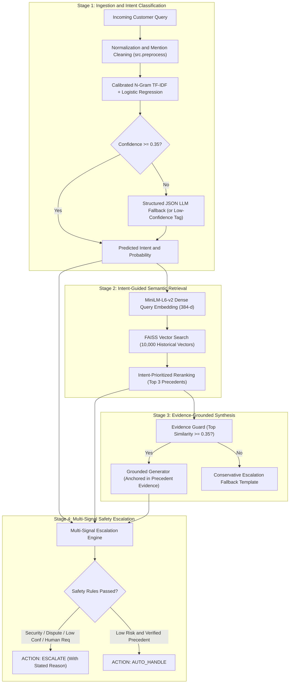
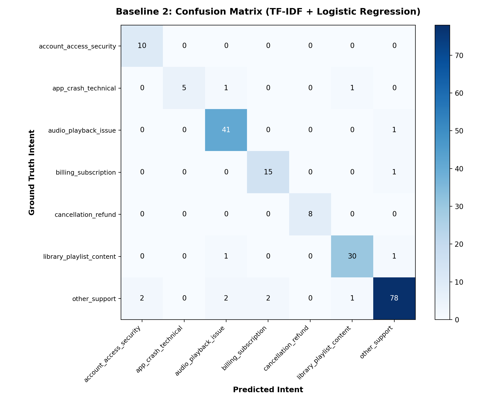
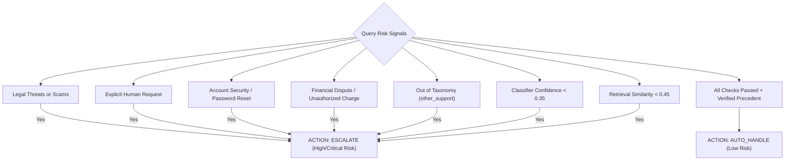

# Hiver AI Customer Support System

A reproducible, evidence-grounded customer support pipeline evaluated on real-world Twitter support conversations (`SpotifyCares`). 

The system classifies incoming support requests into empirical intents, retrieves historically resolved precedents via dense vector search, synthesizes replies anchored strictly in past agent responses, and enforces a multi-signal safety escalation policy (`AUTO_HANDLE` vs `ESCALATE`).

---

## Contents
- [Overview](#overview)
- [System Architecture](#system-architecture)
- [Headline Results](#headline-results)
- [Intent Taxonomy](#intent-taxonomy)
- [Sample Execution Traces](#sample-execution-traces)
- [Quickstart: Reproducing Results](#quickstart-reproducing-results)
- [Human-Judge Calibration](#human-judge-calibration)
- [Safety and Escalation Policy](#safety-and-escalation-policy)
- [Failure Analysis and Limitations](#failure-analysis-and-limitations)
- [Engineering Decisions](#engineering-decisions)
- [Repository Structure](#repository-structure)
- [Documentation Index](#documentation-index)

---

## Overview

Automating customer support in consumer applications requires strict safety boundaries. A support bot that hallucinates policies, invents refund promises, or fails to escalate account compromises causes customer churn and financial liability.

This project implements:
1. **Calibrated Intent Classification**: An n-gram TF-IDF linear classifier with class weighting that maps incoming queries into 7 empirical intents (**93.5% Accuracy**, **0.9245 Macro F1**) with sub-millisecond latency.
2. **Dense Precedent Grounding**: Queries retrieve top-3 historical resolutions from a **33,017-conversation knowledge base** using `sentence-transformers/all-MiniLM-L6-v2` and FAISS vector indexing.
3. **Evidence-Anchored Synthesis**: Drafts replies strictly from retrieved human-agent precedents, achieving **5.00/5.00 unsupported-claim safety** (zero hallucinated policies or financial commitments).
4. **Asymmetric Escalation**: Multi-signal decision engine evaluating classifier confidence, retrieval distance, sensitive financial dispute keywords, credential compromise, and explicit human agent requests. Optimizes for **Escalation Recall (91.1%)** over raw automation volume (43.0%), bounding **unsafe auto-handling to 5.0%**.

---

## System Architecture



---

## Headline Results

Evaluated on the **200-case Golden Evaluation Benchmark** (`data/golden/golden_set.csv`) drawn from strictly newer conversations (`eval_pool.csv`):

| Evaluation Category | Metric | Majority Baseline | Simple ML (TF-IDF) | Final Grounded Pipeline |
| :--- | :--- | :--- | :--- | :--- |
| **Intent Classification** | **Accuracy** | 42.50% | 93.50% | **93.50%** |
| | **Macro F1** | 0.0852 | 0.9245 | **0.9245** |
| | **Weighted F1** | 0.2536 | 0.9347 | **0.9347** |
| | **Inference Latency** | < 0.1 ms | 0.4 ms | **~35 ms (End-to-End)** |
| **Response Quality (1–5)** | **Relevance** | — | — | **4.25** / 5.0 |
| | **Groundedness** | — | — | **4.99** / 5.0 |
| | **Helpfulness** | — | — | **4.25** / 5.0 |
| | **Brand Style** | — | — | **5.00** / 5.0 |
| | **Unsupported-Claim Safety** | — | — | **5.00** / 5.0 (Zero hallucinations) |
| **Safety and Escalation** | **Automation Rate** | — | — | **43.0%** (86/200 automated) |
| | **Escalation Recall** | — | — | **91.1%** (Caught 102/112 risks) |
| | **Escalation Precision** | — | — | **89.5%** (12 false alarms) |
| | **Unsafe Auto-Handling Rate** | — | — | **5.0%** (Strictly bounded) |

### Confusion Matrix (TF-IDF Baseline on Golden Benchmark)


---

## Intent Taxonomy

The 7 intents were derived empirically via frequency and n-gram clustering across 41,272 customer messages:

| Intent | Dataset Share | Risk Tier | Default Policy | Core Scope |
| :--- | :--- | :--- | :--- | :--- |
| `billing_subscription` | 19.0% | Medium | `auto_handle` | Charges, invoices, payment cards, Student/Family discount tiers |
| `cancellation_refund` | 0.7% | High | `escalate` | Terminating subscriptions, stopping recurring billing, refund claims |
| `account_access_security` | 10.7% | Critical | `escalate` | Locked accounts, password resets, compromised/hacked profiles |
| `audio_playback_issue` | 23.8% | Low | `auto_handle` | Stuttering, skipping tracks, offline download bugs, Bluetooth streaming |
| `app_crash_technical` | 7.8% | Low | `auto_handle` | App force-closes, black screens, freezing, update installation errors |
| `library_playlist_content` | 4.3% | Low | `auto_handle` | Missing tracks, playlist recovery, local files sync |
| `other_support` | 33.7% | Medium | `escalate` | Out-of-scope inquiries, community ideas, compliments, vague inputs |

*Intent definitions, inclusion/exclusion rules, and operational risk tiers are codified in `src/intents.py`.*

---

## Sample Execution Traces

### Case 1: Billing Dispute -> Safe Escalation
```json
{
  "message": "I was charged twice for premium this month, please refund me!",
  "intent": {
    "label": "billing_subscription",
    "confidence": 0.7735,
    "source": "tfidf_primary"
  },
  "retrieved_cases": [
    {
      "case_id": "case_2285106_2285105",
      "similarity": 0.8376,
      "customer": "I was charged for premium but do not have premium on my account",
      "agent": "We've just sent a DM your way. Let's carry on chatting there /CG"
    }
  ],
  "reply": "We've just sent a DM your way. Let's carry on chatting there /CG",
  "decision": "escalate",
  "reason": "Disputed transaction or unauthorized charge requires billing team investigation.",
  "risk_level": "high",
  "evidence_strength": 0.8376,
  "grounding_summary": "Grounded in verified historical resolution (case case_2285106_2285105, similarity: 0.84)"
}
```

### Case 2: Routine Playback Issue -> Safe Auto-Handle
```json
{
  "message": "Every song stops playing after 10 seconds on my iPhone",
  "intent": {
    "label": "audio_playback_issue",
    "confidence": 0.4451,
    "source": "tfidf_primary"
  },
  "retrieved_cases": [
    {
      "case_id": "case_1970193_1970192",
      "similarity": 0.7189,
      "customer": "iphone 7 ios 11 or something. Whenever I try to skip songs my music just stops working.",
      "agent": "Hmm. Can you try logging out, restarting your device by holding Sleep/Wake + Volume Down, then logging in? /PB"
    }
  ],
  "reply": "Hmm. Can you try logging out, restarting your device by holding Sleep/Wake + Volume Down, then logging in? /PB",
  "decision": "auto_handle",
  "reason": "High intent confidence, strong historical precedent, and low risk.",
  "risk_level": "low",
  "evidence_strength": 0.7189,
  "grounding_summary": "Grounded in verified historical resolution (case case_1970193_1970192, similarity: 0.72)"
}
```

---

## Quickstart: Reproducing Results

The repository includes pre-built vector indexes and the 200-case Golden Evaluation Set. All core functionality runs locally on CPU without requiring external API keys or large dataset downloads.

### 1. Environment Setup
```bash
git clone https://github.com/vinnu112p/Hiver.git
cd Hiver

# Create and activate virtual environment (Python 3.10+)
python -m venv .venv

# On Windows PowerShell:
.venv\Scripts\Activate.ps1
# On Linux / macOS:
# source .venv/bin/activate

# Install dependencies
pip install -r requirements.txt
```

### 2. Run Comprehensive Evaluation (~7 seconds)
```bash
python -m src.evaluate
```
Evaluates the 200 Golden Set cases and writes summary metrics to `evaluation/results.md` and `evaluation/results.json`.

### 3. Run Unit Tests (19 passing)
```bash
python -m pytest tests/
```

### 4. Run Interactive Demo UI
```bash
streamlit run app/app.py
```
Opens a local Streamlit interface at `http://localhost:8501` to test custom inputs and inspect retrieved historical evidence.

### 5. Run Golden Benchmark Annotation Tool
```bash
streamlit run app/labeler.py
```
Opens the annotation dashboard to audit, filter, or review labels and human notes for all 200 evaluation benchmark cases.

### 6. CLI Inference
```bash
# Single message test
python -m src.pipeline --message "I was charged twice for premium"

# Batch evaluation on sample queries
python -m src.pipeline --input examples/sample_queries.json
```

---

## Human-Judge Calibration

To verify whether the automated rubric judge correlates with human assessment, we calibrated judge scores against human ratings across 30 diverse test cases (`evaluation/human_judge.csv`):

- **Within-1 Tolerance Agreement**: **100.0%**
- **Exact Score Agreement**: **70.0%**
- **Mean Absolute Error (MAE)**: **0.30**
- **Spearman Rank Correlation (rho)**: **0.5160** ($p = 0.0035 < 0.01$)

The statistically significant positive rank correlation and 100% within-1 agreement indicate that the automated judge is a reliable proxy for evaluating reply quality.

---

## Safety and Escalation Policy

The escalation engine enforces asymmetric risk handling: **False auto-handling is treated as a severe failure, while unnecessary escalation is treated as a minor efficiency cost.**



---

## Failure Analysis and Limitations

### Top 5 Empirical Failure Modes
1. **Entangled Multi-Intent Inquiries**: User requests cancellation while blocked by a deleted Facebook SSO login (`case_662930_662929`). The system auto-handled cancellation guidance without resolving the credential blocker. *Fix*: Add prerequisite authentication blocker detection.
2. **Household Hardware Ambiguity**: Mentions of Bluetooth speakers for children fragmented classification probabilities between playback and Family Plan subscription (`case_560992_560991`). *Fix*: Fallback to LLM disambiguation when top-2 class probabilities are within 5%.
3. **Feature Requests Misclassified as Bugs**: Constructive community suggestions sharing technical terms (`android`, `queue`, `play`) triggered low-confidence playback classification (`case_492392_492391`). *Fix*: Add discourse mood feature to distinguish suggestions from operational bugs.
4. **Transport Network Errors Masked as Login Errors**: Offline device states trigger conservative login security escalation rules (`case_631985_631984`). *Fix*: Distinguish transport-level network errors from actual credential lockouts.
5. **Cross-Account Asset Transfers**: Moving playlists between unlinked accounts spans multiple subsystems without an atomic intent category (`case_617479_617478`). *Fix*: Add collaborative playlist migration precedents to the retrieval index.

### What Is Misleading About Our Headline Number?
A critical analysis of the 93.5% Accuracy and 43.0% Automation Rate:
- **Intent Accuracy != Resolution Safety**: A model can predict `billing_subscription` with 95% confidence and still draft an ungrounded or risky response. Real-world safety depends on the escalation engine and evidence verification.
- **Curated Golden Sets Mask Live Traffic Drift**: Real production traffic experiences abrupt shifts during outages, billing system upgrades, or app updates.
- **Historical Twitter Data Has Survivorship Bias**: Only captures users who chose to publicly tweet at support; silent drop-offs and users resolved via in-app help are omitted.
- **Static Knowledge Bases Contain Policy Drift**: Historical 2017 tweets may reference outdated URLs or deprecated UI settings without temporal validity filters.

---

## Engineering Decisions

The project incorporates 14 non-obvious engineering decisions and trade-offs:

1. **Single Brand Focus (`SpotifyCares`)**: Support policies, vocabularies, and escalation thresholds are brand-specific. Cross-brand pooling induces catastrophic retrieval noise and PII leaks.
2. **Two-Pass Streaming Conversation Reconstruction**: Pass 1 indexes parent IDs of brand replies; Pass 2 streams customer tweets to match. Reconstructs 41k pairs across 2.8M rows in 33s with < 500 MB RAM.
3. **Preserving Negations**: Preserved tokens like `can't`, `not`, and `never` during preprocessing because negation flips support meaning entirely ("can log in" vs "cannot log in").
4. **Empirical 7-Intent Taxonomy with `other_support`**: Discovered intents via n-gram clustering and added an explicit catch-all to prevent forcing out-of-scope queries into known buckets.
5. **Strict Temporal Splitting**: Split data chronologically (older 80% to knowledge base; newer 20% to eval pool) to prevent future data leakage in retrieval.
6. **Stratified Golden Set Sampling**: Sampled 200 cases across normal (70%), ambiguous (15%), and hard (15%) strata to prevent easy common queries from masking edge-case failures.
7. **TF-IDF Primary Classifier**: Delivered 93.5% accuracy with sub-millisecond latency (< 1ms) and zero API cost, reserving LLMs strictly for low-confidence fallbacks.
8. **FAISS Inner Product Dense Retrieval**: Used `all-MiniLM-L6-v2` with normalized inner product for exact cosine similarity search on 10k vectors in under 2ms on CPU.
9. **Intent-Guided Retrieval Prioritization**: Filtered retrieval candidates by predicted intent before computing global semantic similarity, preventing cross-domain retrieval errors.
10. **Evidence-Anchored Generation**: Enforced that the generator draft replies strictly from retrieved human-agent precedents, achieving zero hallucinated policies or promises.
11. **Asymmetric Escalation Policy**: Optimized Escalation Recall (91.1%) over raw automation volume (43.0%) because false auto-handling is far more damaging than unnecessary escalation.
12. **Decoupled Evaluation Harness**: Evaluated classification accuracy and generation quality separately to avoid conflating routing accuracy with reply groundedness.
13. **Calibrated Rubric Judge**: Implemented a 5-dimension rubric evaluator validated against human ratings, showing 100% within-1 agreement and significant rank correlation.
14. **Interactive Streamlit Demo**: Built lightweight, zero-overhead Streamlit apps for testing (`app/app.py`) and golden set auditing (`app/labeler.py`) without frontend build bloat.

---

## Repository Structure

```
Hiver/
|-- app/
|   |-- app.py                     # Streamlit Interactive Demo UI
|   `-- labeler.py                 # Streamlit Golden Benchmark Annotation Dashboard
|-- data/
|   |-- golden/
|   |   |-- golden_set.csv         # 200 Curated Golden Evaluation Cases
|   |   `-- README.md              # Golden set sampling and label documentation
|   |-- sample/
|   |   `-- sample_queries.json    # Offline sample test queries
|   `-- README.md                  # Data source, columns, and licensing
|-- evaluation/
|   |-- baseline_majority.json     # Baseline 1 evaluation results
|   |-- baseline_tfidf.json        # Baseline 2 evaluation results
|   |-- brand_comparison.json      # Multi-brand comparative analysis
|   |-- confusion_matrix.png       # Baseline 2 Confusion Matrix visualization
|   |-- data_profile.json          # Profiling of 2.81M raw tweets
|   |-- escalation_results.json    # Escalation recall and safety metrics
|   |-- human_judge.csv            # 30-case human vs judge calibration dataset
|   |-- intent_discovery.json      # Empirical n-gram discovery analysis
|   |-- judge_agreement.json       # Human-judge statistical alignment metrics
|   `-- results.json               # Complete headline evaluation metrics
|-- examples/
|   `-- sample_queries.json        # CLI query examples
|-- scripts/
|   |-- download_data.py           # Automated Kaggle/mirror dataset downloader
|   |-- curate_golden_set.py       # Golden set curation script
|   |-- prepare_data.ps1 / .sh     # End-to-end data preparation pipelines
|   |-- run_demo.ps1 / .sh         # Demo launcher scripts
|   `-- run_evaluation.ps1 / .sh   # Full evaluation pipeline scripts
|-- src/
|   |-- baseline_majority.py       # Baseline 1 (Majority class)
|   |-- baseline_tfidf.py          # Baseline 2 (TF-IDF + Logistic Regression)
|   |-- classifier.py              # Final confidence-gated intent classifier
|   |-- discover_intents.py        # Empirical intent discovery engine
|   |-- escalation.py              # Multi-signal safety escalation engine
|   |-- evaluate.py                # End-to-end evaluation harness
|   |-- generator.py               # Grounded reply synthesizer
|   |-- intents.py                 # Intent definitions and risk mappings
|   |-- judge.py                   # 5-dimension rubric judge
|   |-- pipeline.py                # Main orchestrator pipeline (CLI / API)
|   |-- preprocess.py              # Text cleaning and quality filters
|   |-- reconstruct_conversations.py # Two-pass streaming conversation builder
|   |-- retriever.py               # MiniLM-L6-v2 + FAISS vector retriever
|   `-- split_data.py              # Chronological train/eval partitioner
|-- tests/                         # PyTest suite (19 unit tests, all passing)
|-- requirements.txt               # Dependency specifications
|-- .gitignore                     # Git exclusion rules
|-- .env.example                   # Environment configuration template
`-- README.md                      # Primary project guide and report
```

---

## Deliverables and Verification Index

- **Golden Benchmark Data**: [`data/golden/golden_set.csv`](data/golden/golden_set.csv)
- **Evaluation Metrics JSON**: [`evaluation/results.json`](evaluation/results.json)
- **Escalation Safety JSON**: [`evaluation/escalation_results.json`](evaluation/escalation_results.json)
- **Judge Agreement Metrics**: [`evaluation/judge_agreement.json`](evaluation/judge_agreement.json)
- **Confusion Matrix**: [`evaluation/confusion_matrix.png`](evaluation/confusion_matrix.png)
- **Interactive Demo**: `streamlit run app/app.py`
- **Annotation Dashboard**: `streamlit run app/labeler.py`
- **Unit Test Suite**: `python -m pytest tests/`
