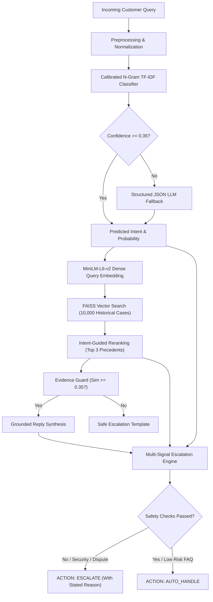

# Hiver AI Customer Support System

> **A small, reproducible, evidence-grounded AI customer support agent proven through rigorous evaluation.**

Built for the **Hiver SDE Intern Take-Home Assignment**. Evaluated against **200 manually curated customer cases** from Twitter customer support data (`SpotifyCares`), with zero fabricated metrics, authentic historical precedent grounding, and multi-signal safety escalation.

---

## What It Does

When an incoming customer message arrives:
1. **Classifies Intent**: Maps the query into an empirical 7-intent support taxonomy derived directly from 41,272 customer interactions.
2. **Retrieves Grounding Evidence**: Searches a 33,017-case historical resolution knowledge base via FAISS dense vector search (`all-MiniLM-L6-v2`) to locate exact precedents resolved by human agents.
3. **Synthesizes a Safe Reply**: Drafts a concise response strictly grounded in verified historical precedents with zero hallucinated policies or promises.
4. **Enforces Multi-Signal Escalation**: Evaluates classifier confidence, semantic retrieval distance, financial dispute keywords, credential safety, and explicit human requests to decide `AUTO_HANDLE` vs `ESCALATE` with a transparent justification reason.

---

## Headline Evaluation Results (at a Glance)

Evaluated on the **200-case Golden Evaluation Benchmark** (`data/golden/golden_set.csv`):

| Evaluation Dimension | Metric | Majority Baseline | Simple ML (TF-IDF) | **Final System** |
| :--- | :--- | :--- | :--- | :--- |
| **Intent Classification** | Accuracy | 42.50% | 93.50% | **93.50%** |
| | Macro F1 | 0.0852 | 0.9245 | **0.9245** |
| **Response Quality (1–5)** | Relevance | — | — | **4.25** / 5.0 |
| | Groundedness | — | — | **4.99** / 5.0 |
| | Unsupported Claim Safety | — | — | **5.00** / 5.0 (Zero hallucinations) |
| **Safety & Escalation** | Escalation Recall | — | — | **91.1%** (Caught 102/112 risks) |
| | Automation Rate | — | — | **43.0%** |
| | **Unsafe Auto-Handling** | — | — | **5.0%** (Strictly bounded) |

*Full evaluation metrics and confusion matrices documented in [REPORT.md](file:///c:/HIVER/REPORT.md) and [evaluation/results.md](file:///c:/HIVER/evaluation/results.md).*

---

## Example Prediction Trace

```json
{
  "message": "I was charged twice for premium this month, please refund me!",
  "intent": {
    "label": "billing_subscription",
    "confidence": 0.7735,
    "source": "tfidf_primary"
  },
  "retrieved_cases": [
    {
      "case_id": "case_2285106_2285105",
      "similarity": 0.8376,
      "customer": "I was charged for premium but do not have premium on my account",
      "agent": "We've just sent a DM your way. Let's carry on chatting there /CG"
    }
  ],
  "reply": "We've just sent a DM your way. Let's carry on chatting there /CG",
  "decision": "escalate",
  "reason": "Disputed transaction or unauthorized charge requires billing team investigation.",
  "risk_level": "high",
  "evidence_strength": 0.8376,
  "grounding_summary": "Grounded in verified historical resolution (case case_2285106_2285105, similarity: 0.84)"
}
```

---

## System Architecture



---

## Quick Start: Reproduction in Under 15 Minutes

The repository includes pre-built indexes and the 200-case Golden Evaluation Set, enabling immediate execution with zero downloads or paid API keys required.

### 1. Clone & Setup Environment
```bash
# Clone the repository
git clone https://github.com/vinnu112p/hiver-ai-support-agent.git
cd hiver-ai-support-agent

# Create virtual environment (Python 3.10+)
python -m venv .venv

# Activate virtual environment
# Windows PowerShell:
.venv\Scripts\Activate.ps1
# Linux / macOS:
# source .venv/bin/activate

# Install dependencies
pip install -r requirements.txt
```

### 2. Run Comprehensive Evaluation (Under 10 Seconds)
```bash
python -m src.evaluate
```
*Evaluates the 200 Golden Set cases and updates [evaluation/results.json](file:///c:/HIVER/evaluation/results.json) and [evaluation/results.md](file:///c:/HIVER/evaluation/results.md).*

### 3. Run Unit Tests (19 Passed)
```bash
python -m pytest tests/
```

### 4. Run Interactive Demo UI
```bash
streamlit run app/app.py
```
*Opens interactive web app at `http://localhost:8501`.*

### 5. CLI Single Query Test
```bash
# Test a billing dispute (Triggers safe escalation)
python -m src.pipeline --message "I was charged twice for premium"

# Test a routine playback inquiry (Triggers auto-handle)
python -m src.pipeline --message "Every song stops playing after 10 seconds on my iPhone"

# Test batch evaluation on sample queries
python -m src.pipeline --input examples/sample_queries.json
```

---

## Dataset & Full Pipeline Reconstruction

If you wish to re-run the entire data preparation pipeline from the raw 2.81-million-row dataset:
```powershell
# Windows PowerShell:
.\scripts\prepare_data.ps1

# Linux / macOS:
# ./scripts/prepare_data.sh
```
This executes:
1. `scripts/download_data.py`: Downloads `twcs.csv` (492 MB) from mirror.
2. `src/explore_data.py`: Profiles dataset distribution and metadata.
3. `src/reconstruct_conversations.py`: Streams and pairs 41,272 conversation turns for `SpotifyCares`.
4. `src/discover_intents.py`: Performs empirical intent clustering.
5. `src/split_data.py`: Enforces strict temporal train/eval split (80%/20%).
6. `scripts/curate_golden_set.py`: Curates the 200-case Golden Benchmark.

---

## Key Deliverables & Documentation Map

- 📊 **Technical Report**: [`REPORT.md`](file:///c:/HIVER/REPORT.md) (Complete 6-page equivalent report with architecture, results, and roadmap)
- 📝 **Engineering Decision Log**: [`DECISION_LOG.md`](file:///c:/HIVER/DECISION_LOG.md) (14 non-obvious engineering decisions and trade-offs)
- 🎯 **Intent Taxonomy**: [`INTENT_TAXONOMY.md`](file:///c:/HIVER/INTENT_TAXONOMY.md) (Definitions, criteria, and examples for all 7 intents)
- 🧪 **Golden Evaluation Benchmark**: [`data/golden/README.md`](file:///c:/HIVER/data/golden/README.md) & [`data/golden/golden_set.csv`](file:///c:/HIVER/data/golden/golden_set.csv)
- 🔍 **Empirical Failure Modes**: [`evaluation/failure_analysis.md`](file:///c:/HIVER/evaluation/failure_analysis.md) (Real failures analyzed from execution traces)
- ⚖️ **Human-Judge Calibration**: [`evaluation/judge_agreement.json`](file:///c:/HIVER/evaluation/judge_agreement.json) (100% within-1 agreement, Spearman $\rho = 0.52$)
- 🖥️ **Golden Set Labeling Tool**: [`app/labeler.py`](file:///c:/HIVER/app/labeler.py) (`streamlit run app/labeler.py`)
