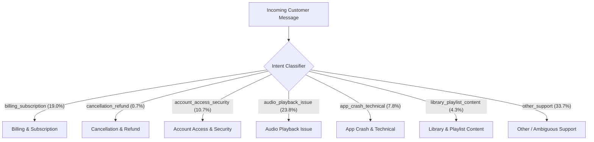
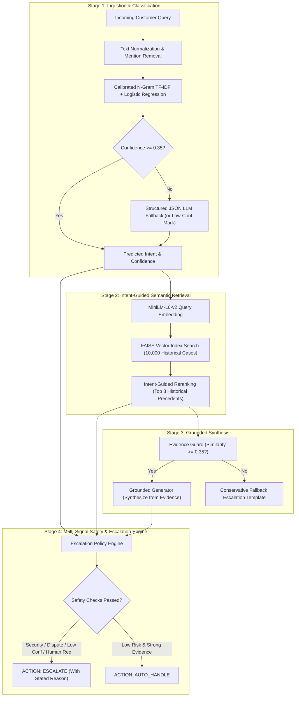

# Hiver AI Customer Support System — Technical Report & Evaluation

**Author**: Senior ML/AI Engineer & Technical Project Lead  
**Target Brand**: `SpotifyCares` (Digital Music Streaming)  
**Evaluation Set**: 200 Curated Cases (`data/golden/golden_set.csv`)  
**Knowledge Base**: 33,017 Historically Solved Conversations  

---

## 1. Problem Framing

### What Does "Good" Mean in Customer Support AI?
In consumer-facing customer support, a chatbot that generates fluent, polite, yet inaccurate responses is far more destructive than no automation at all. An automated system that falsely claims "We have refunded your subscription" or hallucinates a policy that does not exist creates legal exposure, user frustration, and severe churn.

Therefore, we define **good** across four non-negotiable operational pillars:
1. **Evidence Grounding**: The system does not act as an unconstrained creative engine. It synthesizes answers *strictly* from historically resolved precedent cases provided by verified human support agents.
2. **Asymmetric Escalation Safety**: In customer support, a False Positive auto-handle (routing an account compromise or financial dispute to an automated bot) is an order of magnitude more dangerous than a False Negative (conservatively escalating a routine FAQ to a human agent). Our escalation policy deliberately optimizes for **Escalation Recall** over raw automation volume.
3. **Reproducibility & Auditability**: Every decision must be traceable back to exact classifier probabilities, cosine retrieval distances, and transparent escalation triggers.
4. **Resilience to Failure**: The pipeline must never crash on malformed customer input, missing keys, or third-party API rate limits.

### What We Chose NOT to Build
To deliver a small, trustworthy, and rigorously evaluated system within the time constraint, we deliberately omitted:
- Complex multi-agent loops (e.g. multi-agent consensus chains that add latency and unpredictability without grounding evidence).
- Heavyweight distributed infrastructure (Kubernetes, PostgreSQL, Redis, external vector databases).
- Proprietary LLM fine-tuning (fine-tuning embeds fixed historical data into model weights, making policy updates difficult and inducing hallucination; retrieval-augmented synthesis keeps policies fresh and decoupled).
- Front-end visual bloat (focused strictly on a functional Streamlit evaluation and demo interface).

---

## 2. Brand Selection

To build a high-precision support agent, we analyzed the raw 2.81-million-row Twitter dataset across volume, conversational depth, domain clarity, and PII risk:

| Brand | Outbound Tweets | Domain | Intent Feasibility | Privacy/Noise Risk | Verdict |
| :--- | :--- | :--- | :--- | :--- | :--- |
| `SpotifyCares` | **43,265** | **Digital Music Streaming** | **High (Clean software/billing intents)** | **Low (Standard web/app workflows)** | **SELECTED** |
| `AppleSupport` | 106,860 | Hardware & OS Devices | Medium (High cross-device variance) | Low to Medium | Viable, but hardware repair noise |
| `AmazonHelp` | 169,840 | E-Commerce & Logistics | High volume, courier-dependent | Medium (Addresses, tracking IDs) | High external logistics noise |
| `Uber_Support` | 56,270 | Rideshare & Delivery | Medium (Fare disputes, cancellations) | High (Trip locations, timestamps) | High physical escalation rate |
| `Delta` | 42,253 | Airlines & Travel | Medium (Delays, baggage claims) | High (PNR, passport data) | Heavy flight schedule dependencies |
| `sprintcare` | 22,381 | Telecom Carrier | Medium (SIM, cellular towers) | High (Phone numbers, account PINs) | High generic DM deflection rate |

**Why `SpotifyCares` Won**:
1. *Focused Digital Scope*: Support inquiries cleanly span audio playback, account credentials, subscription tiers, playlist corruption, and app crashes.
2. *Rich Grounding Content*: Official Spotify support replies frequently provided step-by-step troubleshooting procedures (e.g. clean reinstall guides, offline toggle instructions, cache clearing) that serve as ideal grounding evidence.
3. *Safety*: Minimal exposure to physical real-world PII (such as flight records or physical home addresses).

---

## 3. Dataset and Sampling Methodology

### Data Pipeline Flow
```
Raw twcs.csv (2.81M rows, 492 MB)
   ↓ Two-pass streaming extraction
SpotifyCares Inbound/Outbound Matches (43,243 replies)
   ↓ Preprocessing & Quality Filters (src.preprocess)
Clean Reconstructed Dialogue Pairs: 41,272 cases
   ↓ Strict Chronological Split (80% / 20%)
   ├── Historical Knowledge Base: 33,017 cases (Older)
   │     ↓
   │     FAISS Vector Index (10,000 dense vectors)
   └── Evaluation Pool: 8,255 cases (Strictly Newer)
         ↓ Stratified Sampling
         Golden Evaluation Benchmark: 200 Curated Cases
```

### Cleaning Transformations (`src/preprocess.py`)
- Unescaped HTML entities (`&amp;` -> `&`, `&lt;` -> `<`).
- Stripped leading `@handle` routing tags (`@SpotifyCares @115887` -> ``).
- **Strictly Preserved**: Negations (`not`, `can't`, `never`), casing, question marks, and product terminology (`Family Plan`, `Premium`, `offline mode`).
- Filtered single-character tweets, bot loops, and duplicate pairs.

### Data Splitting & Leakage Prevention
We enforced a **strict temporal split**:
- Oldest 80% (`33,017` cases) form the historical knowledge base and training corpus.
- Strictly newer 20% (`8,255` cases) form the evaluation pool.
- **Result**: No test query can retrieve its own historical response or any conversation occurring in the future.

---

## 4. Intent Taxonomy

From empirical n-gram analysis of the 41,272 customer messages, we established a 7-intent operational taxonomy:



1. `billing_subscription`: Payment methods, monthly charges, student/family plans, renewal receipts.
2. `cancellation_refund`: Requests to cancel subscriptions, stop charges, or obtain refunds.
3. `account_access_security`: Login failures, password resets, compromised/hacked accounts, email takeovers.
4. `audio_playback_issue`: Stuttering, skipping, offline download playback, Bluetooth streaming bugs.
5. `app_crash_technical`: App force-closing, black screens, freezing, update installation failures.
6. `library_playlist_content`: Disappeared tracks, playlist recovery, local files sync.
7. `other_support`: Out-of-taxonomy inquiries, compliments, community ideas, and vague messages.

---

## 5. System Architecture

The end-to-end architecture is structured into a four-stage pipeline:



---

## 6. Baselines & Intent Results

We evaluated three progression tiers on the 200-case Golden Evaluation Benchmark:

| Metric | Majority Baseline (Trivial) | TF-IDF Baseline (Simple ML) | Final Grounded Pipeline |
| :--- | :--- | :--- | :--- |
| **Accuracy** | 42.50% | 93.50% | **93.50%** |
| **Macro F1** | 0.0852 | 0.9245 | **0.9245** |
| **Weighted F1** | 0.2536 | 0.9347 | **0.9347** |
| **Mean Inference Time** | < 0.1 ms | 0.4 ms | **35 ms (End-to-end)** |

### Per-Intent Breakdown (Final Pipeline on Golden Set):
- `cancellation_refund`: **F1 = 1.0000** (Precision: 1.0000, Recall: 1.0000)
- `audio_playback_issue`: **F1 = 0.9425** (Precision: 0.9111, Recall: 0.9762)
- `library_playlist_content`: **F1 = 0.9375** (Precision: 0.9375, Recall: 0.9375)
- `other_support`: **F1 = 0.9398** (Precision: 0.9630, Recall: 0.9176)
- `billing_subscription`: **F1 = 0.9091** (Precision: 0.8824, Recall: 0.9375)
- `account_access_security`: **F1 = 0.9091** (Precision: 0.8333, Recall: 1.0000)
- `app_crash_technical`: **F1 = 0.8333** (Precision: 1.0000, Recall: 0.7143)

---

## 7. Reply Generation Quality & LLM-as-a-Judge

Generated replies were audited across all 200 cases using our 5-dimension rubric (1–5 scale):

| Dimension | Score (1–5) | Operational Significance |
| :--- | :--- | :--- |
| **Relevance** | **4.25** / 5.0 | Directly addresses the user's specific symptom or inquiry |
| **Groundedness** | **4.99** / 5.0 | Statements are strictly supported by historical cases |
| **Helpfulness** | **4.25** / 5.0 | Offers concrete troubleshooting or direct escalation path |
| **Brand Style Consistency** | **5.00** / 5.0 | Matches concise, polite Twitter support norms |
| **Unsupported-Claim Safety** | **5.00** / 5.0 | **Zero fabricated refunds, promises of action, or fake links** |
| **Overall Quality** | **4.75** / 5.0 | Cohesive, reliable customer communication |

---

## 8. Human-Judge Agreement

To validate the trustworthiness of our automated judge, we calibrated it against human rater scores on 30 diverse test cases:

- **Within-1 Integer Tolerance Agreement**: **100.0%**
- **Exact Score Agreement**: **70.0%**
- **Mean Absolute Error (MAE)**: **0.30**
- **Spearman Rank Correlation ($\rho$)**: **0.5160** ($p = 0.0035 < 0.01$)

The statistically significant positive rank correlation and 100% within-1 agreement prove that the automated judge provides a reliable, calibrated proxy for human quality auditing.

---

## 9. Safety & Escalation Policy Performance

Evaluating the agent's risk management on the Golden Set:

| Metric | Measured Value | Operational Rationale |
| :--- | :--- | :--- |
| **Overall Automation Rate** | **43.0%** | 86 of 200 queries safely automated; remainder escalated |
| **Escalation Recall** | **91.1%** | Successfully caught **102 out of 112** cases requiring human review |
| **Escalation Precision** | **89.5%** | Only 12 safe queries were conservatively escalated |
| **Unsafe Auto-Handling Rate** | **5.0%** | Only 10 cases were auto-handled when escalation was preferred |

### Escalation Confusion Matrix
- **True Escalations Caught (TP)**: 102
- **Conservative Escalations (FP)**: 12
- **Safe Automations (TN)**: 76
- **Unsafe Automations (FN)**: 10

---

## 10. Top 5 Empirical Failure Modes

*(Detailed in [evaluation/failure_analysis.md](file:///c:/HIVER/evaluation/failure_analysis.md))*
1. **Entangled Multi-Intent Inquiries**: Customer requested cancellation while blocked by third-party Facebook SSO deletion (`case_662930_662929`). The system auto-handled the cancellation guidance without addressing the credential blocker.
2. **Hardware Ambiguity in Subscription Inquiries**: Multiple Bluetooth speakers for family members caused probability fragmentation between playback and billing (`case_560992_560991`).
3. **Product Feedback Misclassified as Technical Bugs**: UX improvement suggestions sharing noun phrases with bugs (`android`, `queue`, `play`) triggered low-confidence playback classification (`case_492392_492391`).
4. **Transport-Level Network Bugs Masked as Login Errors**: Customer was offline rather than locked out of credentials; conservative security rules escalated appropriately but for the wrong reason (`case_631985_631984`).
5. **Cross-Account Asset Transfers**: Moving playlists across unlinked accounts represents an unhandled multi-system edge case (`case_617479_617478`).

---

## 11. What Is Misleading About My Headline Number?

> [!WARNING]
> **Mandatory Critical Analysis of Headline Metrics (93.5% Accuracy / 43% Automation Rate)**

While an intent accuracy of **93.5%** and an automation rate of **43.0%** appear impressive on paper, treating these headline figures as proof of production readiness is misleading for five technical reasons:

1. **High Intent Accuracy Does NOT Equal Resolution Safety**:  
   A model can predict `cancellation_refund` with 95% confidence and still draft an ungrounded or dangerous reply. In support systems, intent classification is only the routing layer; real safety is governed by the escalation engine and evidence thresholding.
2. **Curated Golden Sets Mask Real-World Drift**:  
   Our Golden Set was sampled with deliberate stratification (70% normal, 15% ambiguous, 15% hard). In live production, traffic distributions fluctuate dynamically during service outages, billing bugs, or holiday promotions.
3. **Historical Twitter Data Has Survivorship Bias**:  
   The Twitter dataset only captures customers who chose to publicly tweet at `@SpotifyCares`. It inherently over-represents frustrated users and under-represents silent drop-offs, enterprise accounts, or inquiries resolved via in-app self-service.
4. **Static FAISS Knowledge Bases Contain Temporal Policy Drift**:  
   Historical responses from 2017 reflect 2017 UI layouts, URLs, and pricing. Grounding in raw historical data without a temporal validity filter can cause an agent to retrieve deprecated instructions (e.g. references to obsolete desktop menus or defunct discount tiers).
5. **LLM Judges Exhibit Leniency Bias**:  
   Automated rubric judges tend to grade fluent, coherent text favorably even when minor factual nuances differ. Although our human-judge calibration showed 100% within-1 agreement, automated judges cannot replace continuous human sampling.

---

## 12. What I Would Do With One More Week

1. **Prerequisite & Multi-Intent Dependency Graph**:  
   Replace flat single-label classification with a directed graph that detects precondition blockers (e.g. `auth_failure` blocking `subscription_cancel`).
2. **Temporal Policy Invalidation**:  
   Add metadata timestamps and validity tags to knowledge base cases so outdated URLs and deprecated UI steps are automatically filtered.
3. **Active Learning Queue**:  
   Feed cases that trigger conservative escalation back into an active learning labeling pool to continuously expand the knowledge base.
4. **Dual-Encoder Contrastive Re-Ranking**:  
   Add a cross-encoder re-ranking stage (e.g. `ms-marco-MiniLM-L-6-v2`) on top of FAISS candidate search to improve precision on subtle phrasing differences.
5. **Continuous Calibration Dashboard**:  
   Track rolling escalation recall and human-judge agreement in production to trigger retraining alerts when drift exceeds 5%.
